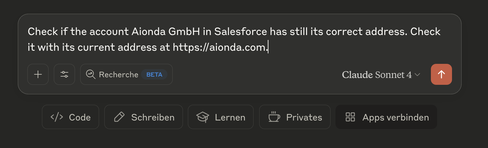
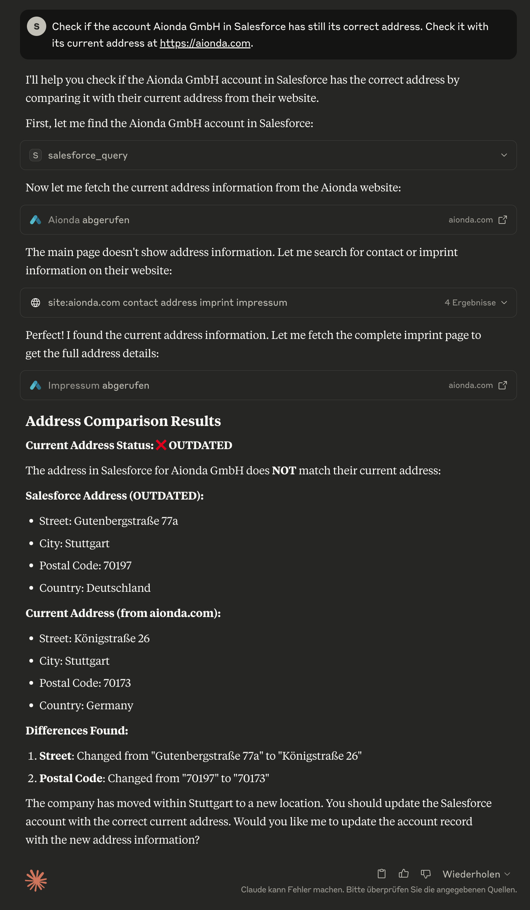
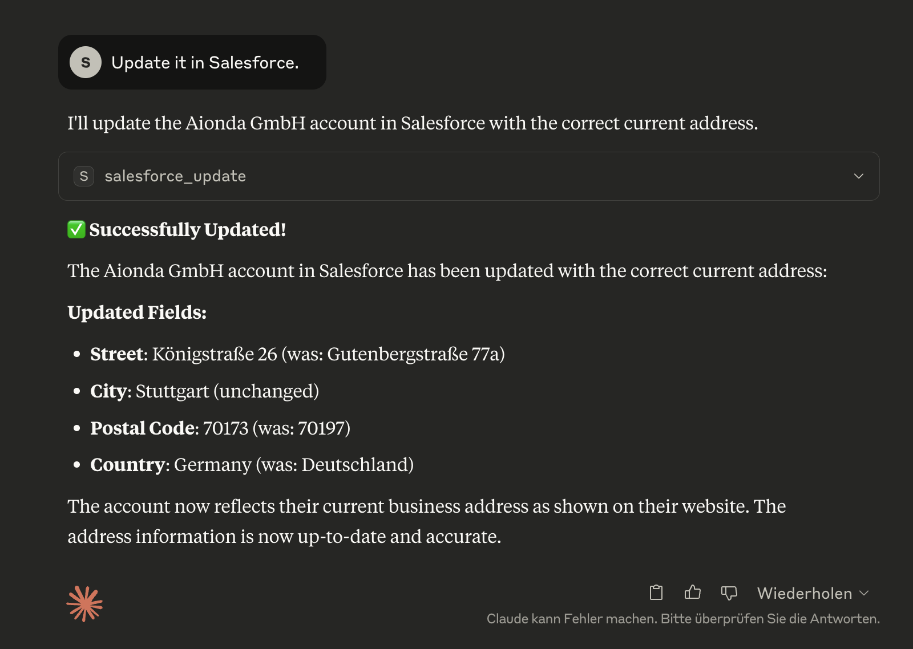
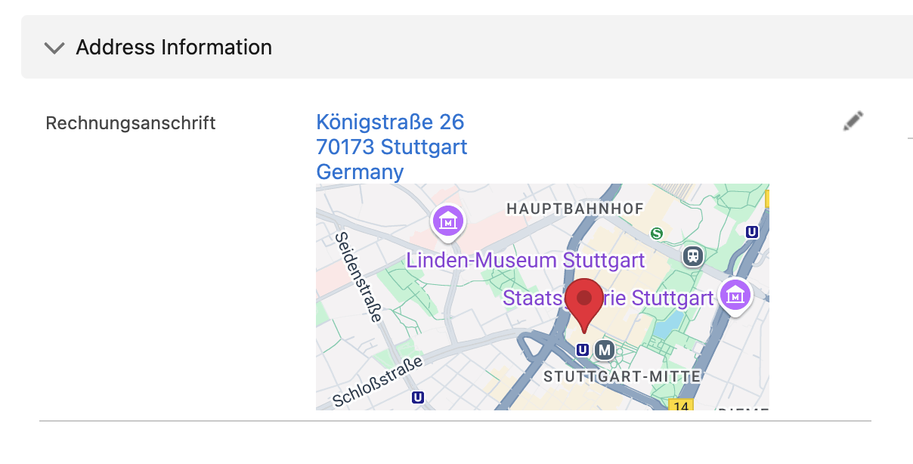

# MCP Salesforce Server

A **Model Context Protocol (MCP) server** that provides seamless integration with Salesforce using OAuth authentication. This server enables AI assistants like Claude to interact with any Salesforce organization through a secure, generic interface.

## ✨ Features

- **🎯 Seamless Authentication** - Claude automatically detects when authentication is needed and handles it transparently
- **🚀 Zero Manual Setup** - No need to run terminal commands or manual OAuth flows
- **🔐 OAuth-Only Authentication** - Secure browser-based setup with automatic token refresh
- **🌐 Universal Salesforce Integration** - Works with any Salesforce org, including custom objects and fields  
- **🧠 Smart Installation Learning** - Analyzes your complete Salesforce setup to provide intelligent assistance
- **🔍 Dynamic Schema Discovery** - Automatically adapts to your Salesforce configuration
- **🔒 Secure Token Storage** - File-based storage with strict permissions for production-grade security
- **📝 Full CRUD Operations** - Query, create, update, and delete any Salesforce records
- **📊 Schema Inspection** - Get detailed information about objects and fields
- **💡 Context-Aware Suggestions** - Provides intelligent field and object name suggestions
- **💾 Comprehensive Backup System** - Complete data and file backup with support for all Salesforce file systems
- **⏰ Time Machine Feature** - Point-in-time data recovery and historical analysis
- **📁 Multi-Format File Support** - Backs up ContentVersions, Attachments, and Documents with proper metadata

## 🚀 Quick Start

### Prerequisites

- **Node.js 18+**
- **macOS** (required for secure token storage)
- **Salesforce Connected App** with OAuth configured

### Installation Options

#### 🎯 **Recommended: NPX Usage (No Installation Required)**

Use NPX to run the MCP server without any permanent installation:

```json
{
  "mcpServers": {
    "salesforce": {
      "command": "npx",
      "args": ["@aiondadotcom/mcp-salesforce"],
      "env": {
        "SALESFORCE_CLIENT_ID": "your-client-id",
        "SALESFORCE_CLIENT_SECRET": "your-client-secret",
        "SALESFORCE_INSTANCE_URL": "https://yourorg.salesforce.com"
      }
    }
  }
}
```

**✅ Benefits of NPX Usage:**
- 🔄 **Always Latest**: Automatically uses the latest published version
- 💾 **No Disk Space**: No permanent installation required
- 🛡️ **No Conflicts**: No global package conflicts
- ⚡ **Easy Updates**: Just restart - gets latest version automatically
- 📋 **Simple Config**: Copy-paste ready MCP configuration

**NPX Command Line Usage:**
```bash
# Get version
npx -p @aiondadotcom/mcp-salesforce mcp-salesforce --version

# Get help
npx -p @aiondadotcom/mcp-salesforce mcp-salesforce --help

# Run OAuth setup
npx -p @aiondadotcom/mcp-salesforce mcp-salesforce setup
```

#### 🔧 **Alternative: Development Setup**

For development or customization:

1. **Clone and install dependencies**:
   ```bash
   git clone https://github.com/AiondaDotCom/mcp-salesforce.git
   cd mcp-salesforce
   npm install
   ```

2. **Configure environment variables**:
   ```bash
   cp .env.example .env
   # Edit .env with your Salesforce Connected App details
   ```

3. **Add to Claude Desktop** using local path (see [Configuration](#configuration) below)

### 🎯 **Start Using**

That's it! Claude will automatically handle authentication when you first use any Salesforce tool.

**✨ No More Manual Setup!** 
- No need to run `npm run setup`
- No terminal authentication required
- Claude automatically detects when authentication is needed
- Seamless OAuth flow directly from Claude Desktop

**🧠 Smart Learning System**
- Use `salesforce_learn` to analyze your complete Salesforce installation
- Claude learns all your custom objects, fields, and relationships
- Provides intelligent suggestions based on your specific setup
- Context-aware assistance for complex Salesforce environments

## 📦 NPM Package Status

✅ **Package Successfully Published!**

The package `@aiondadotcom/mcp-salesforce` is now **live on NPM** and ready for use.

### Using the Published Package

NPX usage is now available for all users:

```bash
# Test the published package
npx -p @aiondadotcom/mcp-salesforce mcp-salesforce --version
npx -p @aiondadotcom/mcp-salesforce mcp-salesforce --help

# Run OAuth setup
npx -p @aiondadotcom/mcp-salesforce mcp-salesforce setup
```

### Publication Details

- **Package Name**: `@aiondadotcom/mcp-salesforce`
- **Version**: `1.0.7` (latest)
- **Registry**: NPM Public Registry
- **Organization**: `@aiondadotcom`
- **Access**: Public

**Status**: 
- ✅ Package published to NPM
- ✅ NPX compatibility verified 
- ✅ Binary wrapper implemented
- ✅ Setup command functional
- ✅ MCP configuration ready
- ✅ **Available for immediate use**

🎉 All NPX functionality now works for end users worldwide!

## 🔧 Configuration

Here's a step-by-step walkthrough of the MCP Salesforce Server in action, showing a real-world use case of verifying and updating company address information:

### Step 1: Address Verification Request

*Claude checking if the Aionda GmbH account in Salesforce has the correct address by comparing it with their current website address*

### Step 2: Address Comparison Results  

*Claude identifying that the Salesforce address is outdated, showing detailed comparison between the current Salesforce data and the actual address from the company website*

### Step 3: Automated Address Update

*Claude successfully updating the Salesforce account with the correct current address, showing exactly which fields were changed*

### Step 4: Verification in Salesforce

*The updated account record in Salesforce showing the corrected address information is now accurate and up-to-date*

## 🔧 Configuration

### Salesforce Connected App Setup

1. In Salesforce Setup, create a new Connected App:
   - **App Name**: MCP Salesforce Integration
   - **API Name**: mcp_salesforce_integration
   - **Contact Email**: Your email
   - **Enable OAuth Settings**: ✅ Yes
   - **Callback URL**: `http://localhost:8080/callback` (will be auto-generated)
   - **Selected OAuth Scopes**:
     - Manage user data via APIs (api)
     - Perform requests at any time (refresh_token, offline_access)

2. After saving, copy the **Consumer Key** and **Consumer Secret**

### Environment Configuration

Create a `.env` file with your Salesforce details:

```bash
SALESFORCE_CLIENT_ID=3MVG9...your-consumer-key...
SALESFORCE_CLIENT_SECRET=1234567890...your-consumer-secret...
SALESFORCE_INSTANCE_URL=https://yourorg.salesforce.com

# Optional settings
SALESFORCE_API_VERSION=v58.0
SALESFORCE_TIMEOUT=30000
LOG_LEVEL=info
```

### Claude Desktop Integration

#### 🎯 **NPX Configuration (Recommended)**

Add this to your Claude Desktop MCP configuration (`~/Library/Application Support/Claude/claude_desktop_config.json`):

```json
{
  "mcpServers": {
    "salesforce": {
      "command": "npx",
      "args": ["@aiondadotcom/mcp-salesforce"],
      "env": {
        "SALESFORCE_CLIENT_ID": "your-client-id",
        "SALESFORCE_CLIENT_SECRET": "your-client-secret", 
        "SALESFORCE_INSTANCE_URL": "https://yourorg.salesforce.com"
      }
    }
  }
}
```

#### 🔧 **Development/Local Configuration**

For development or customized installations:

```json
{
  "mcpServers": {
    "salesforce": {
      "command": "node",
      "args": ["/path/to/mcp-salesforce/src/index.js"],
      "env": {
        "SALESFORCE_CLIENT_ID": "your-client-id",
        "SALESFORCE_CLIENT_SECRET": "your-client-secret", 
        "SALESFORCE_INSTANCE_URL": "https://yourorg.salesforce.com"
      }
    }
  }
}
```

#### 🌐 **VS Code MCP Configuration**

For VS Code with MCP extension:

```json
{
  "servers": {
    "salesforce": {
      "command": "npx",
      "args": ["@aiondadotcom/mcp-salesforce"],
      "env": {
        "SALESFORCE_CLIENT_ID": "your-client-id",
        "SALESFORCE_CLIENT_SECRET": "your-client-secret",
        "SALESFORCE_INSTANCE_URL": "https://yourorg.salesforce.com"
      }
    }
  }
}
```

## 📸 Demo Screenshots

Here's a step-by-step walkthrough of the MCP Salesforce Server in action, showing a real-world use case of verifying and updating company address information:

### Step 1: Address Verification Request

*Claude checking if the Aionda GmbH account in Salesforce has the correct address by comparing it with their current website address*

### Step 2: Address Comparison Results  

*Claude identifying that the Salesforce address is outdated, showing detailed comparison between the current Salesforce data and the actual address from the company website*

### Step 3: Automated Address Update

*Claude successfully updating the Salesforce account with the correct current address, showing exactly which fields were changed*

### Step 4: Verification in Salesforce

*The updated account record in Salesforce showing the corrected address information is now accurate and up-to-date*

## 🛠️ Available Tools

### `salesforce_learn`
**🧠 Lernt deine komplette Salesforce-Installation kennen** - Analysiert alle Objekte, Felder und Anpassungen einmalig und speichert diese Informationen lokal für intelligente Unterstützung.

```javascript
// Einmalige Analyse der Salesforce-Installation
{}

// Erzwinge komplette Neuanalyse
{
  "force_refresh": true,
  "detailed_relationships": true
}
```

**Warum wichtig?** 
- Claude lernt deine Custom Objects wie "Zeitabrechnung__c", "Projekt__c", etc.
- Erkennt alle Custom Fields und deren Datentypen
- Bietet intelligente Vorschläge basierend auf deiner spezifischen Konfiguration
- Einmalig ausführen, dann profitiert die KI dauerhaft davon

### `salesforce_installation_info`
**📊 Überblick über deine gelernte Salesforce-Installation** - Zeigt verfügbare Objekte, Custom Fields und Anpassungen.

```javascript
// Gesamtüberblick über die Installation
{}

// Details zu einem spezifischen Objekt
{
  "object_name": "Zeitabrechnung__c"
}

// Suche nach bestimmten Feldern
{
  "field_search": "email",
  "show_custom_only": true
}
```

### `salesforce_query`
Execute SOQL queries against any Salesforce object.

```javascript
// Example: Get recent contacts
{
  "query": "SELECT Id, FirstName, LastName, Email FROM Contact WHERE CreatedDate = THIS_MONTH ORDER BY CreatedDate DESC LIMIT 10"
}
```

**🧠 Smart Learning Integration:** 
- Warnt automatisch, wenn Installation noch nicht gelernt wurde
- Schlägt verfügbare Objekte und Felder vor
- Hilft bei korrekten API-Namen

### `salesforce_create`  
Create new records in any Salesforce object.

```javascript
// Example: Create a new contact
{
  "sobject": "Contact",
  "data": {
    "FirstName": "John",
    "LastName": "Doe", 
    "Email": "john.doe@example.com",
    "Phone": "555-1234"
  }
}
```

**🧠 Smart Context:** Zeigt automatisch erforderliche Felder für das gewählte Objekt an, wenn die Installation gelernt wurde.

### `salesforce_update`
Update existing records.

```javascript
// Example: Update a contact's email
{
  "sobject": "Contact",
  "id": "003XX000008b6cYAQ",
  "data": {
    "Email": "new.email@example.com",
    "Phone": "555-5678"
  }
}
```

**🧠 Smart Context:** Berücksichtigt Feld-Berechtigungen und Datentypen aus der gelernten Installation.

### `salesforce_delete`
Delete records (⚠️ permanent action).

```javascript
// Example: Delete a record
{
  "sobject": "Contact", 
  "id": "003XX000008b6cYAQ"
}
```

### `salesforce_describe`
Get schema information for objects and fields.

```javascript
// Example: Get Contact object schema
{
  "sobject": "Contact"
}

// Or get list of all available objects
{} // Empty parameters
```

### `salesforce_backup`
**💾 Umfassendes Backup-System für Salesforce** - Erstellt vollständige Backups aller Daten und Dateien mit detaillierter Wiederherstellungsinformation.

```javascript
// Vollständiges Backup erstellen
{}

// Inkrementelles Backup seit bestimmtem Datum
{
  "backup_type": "incremental",
  "since_date": "2025-01-01T00:00:00Z"
}

// Backup mit spezifischen Optionen
{
  "options": {
    "include_files": true,
    "include_attachments": true,
    "include_documents": true,
    "parallel_downloads": 10
  }
}
```

**Was wird gesichert:**
- **📊 Alle Objektdaten** - Sämtliche queryable Objekte mit bis zu 20 Feldern pro Objekt
- **📁 Modern Files** - ContentVersions mit vollständigen Metadaten
- **📎 Legacy Attachments** - Klassische Anhänge mit korrekten Dateierweiterungen
- **📄 Documents** - Folder-basierte Dokumente aus dem Legacy-System
- **🏗️ Schema-Informationen** - Komplette Objektstrukturen und Beziehungen
- **📋 Backup-Manifest** - Detaillierte Statistiken und Wiederherstellungsinfo

**Backup-Struktur:**
```
salesforce-backup-2025-06-04T16-16-35-660Z/
├── metadata/           # Schema und Objektdefinitionen
├── data/              # JSON-Daten aller Objekte
├── files/
│   ├── content-versions/  # Moderne Dateien
│   ├── attachments/       # Legacy Anhänge
│   └── documents/         # Legacy Dokumente
└── backup-manifest.json   # Backup-Übersicht
```

### `salesforce_backup_list`
**📋 Verfügbare Backups anzeigen** - Übersicht über alle lokalen Backups mit Statistiken und Metadaten.

```javascript
// Alle verfügbaren Backups auflisten
{}

// Details zu einem spezifischen Backup
{
  "backup_name": "salesforce-backup-2025-06-04T16-16-35-660Z"
}
```

### `salesforce_time_machine`
**⏰ Zeit-Reise durch Salesforce-Daten** - Analysiert Datenänderungen zwischen verschiedenen Backup-Zeitpunkten und ermöglicht gezielte Wiederherstellung.

```javascript
// Vergleiche aktuellen Zustand mit einem Backup
{
  "backup_timestamp": "2025-06-04T16:16:35.660Z",
  "object_name": "Account"
}

// Zeige alle Änderungen seit einem bestimmten Backup
{
  "backup_timestamp": "2025-06-04T16:16:35.660Z",
  "show_all_changes": true
}

// Detailanalyse für spezifische Datensätze
{
  "backup_timestamp": "2025-06-04T16:16:35.660Z",
  "object_name": "Contact", 
  "record_id": "003XX000008b6cYAQ"
}
```

**Time Machine Funktionen:**
- **📊 Datenvergleich** - Zeigt Unterschiede zwischen Backup und aktuellem Zustand
- **🔍 Änderungshistorie** - Welche Felder wurden wann geändert
- **🗑️ Gelöschte Datensätze** - Findet Datensätze, die seit dem Backup gelöscht wurden
- **📈 Wachstumsanalyse** - Statistische Auswertung der Datenentwicklung
- **🎯 Gezielte Wiederherstellung** - Präzise Identifikation von Änderungen

### `salesforce_auth`
Authenticate with Salesforce. Automatically detects if authentication is needed and handles OAuth flow.

```javascript
// Example: Standard authentication (detects if needed)
{}

// Example: Force re-authentication even if tokens appear valid
{
  "force": true
}
```

**✨ Key Features:**
- **Automatic Detection**: Claude automatically suggests this tool when authentication is needed
- **No Manual Setup**: Eliminates the need to run `npm run setup` manually  
- **Smart Authentication**: Only authenticates when necessary, checks existing tokens first
- **Seamless Integration**: Works transparently in the background

This tool is **automatically suggested** when:
- You try to use Salesforce tools without authentication
- Your tokens have expired
- Authentication errors occur
- First-time setup is needed

## 🧠 Smart Learning System

### Warum ist das Learning wichtig?

Jede Salesforce-Installation ist einzigartig mit:
- **Custom Objects** wie "Zeitabrechnung__c", "Projekt__c", "Kundenbetreuung__c"
- **Custom Fields** auf Standard-Objekten
- **Spezifische Workflows** und Validierungsregeln
- **Individuelle Datenstrukturen**

Das normale Trainingsmodell der KI kennt nur Salesforce-Standardobjekte. Ohne Kenntnisse deiner spezifischen Installation kann die KI nicht intelligent assistieren.

### Wie funktioniert das Learning?

1. **Einmalige Analyse**: `salesforce_learn` analysiert deine komplette Installation
2. **Lokale Dokumentation**: Alle Objekte, Felder und Beziehungen werden lokal gespeichert
3. **Intelligente Unterstützung**: Claude kann dann präzise Vorschläge machen und komplexe Fragen beantworten

### Beispiel-Workflow:

```
Du: "Gibt es eine Zeitabrechnung für Juli 2025?"

Ohne Learning:
❌ Claude: "Ich kenne kein Objekt namens 'Zeitabrechnung'"

Mit Learning:
✅ Claude: "Ich prüfe das Objekt 'Zeitabrechnung__c' nach Einträgen für Juli 2025..."
   Führt automatisch die richtige SOQL-Abfrage aus
```

### Wann solltest du das Learning verwenden?

- **Beim ersten Setup** - Einmalig nach der Installation
- **Bei größeren Änderungen** - Wenn neue Custom Objects hinzugefügt werden
- **Bei Problemen** - Wenn Claude Objekte oder Felder nicht findet

### Was wird gelernt?

- **Alle SObjects** (Standard und Custom)
- **Alle Felder** mit Datentypen und Berechtigungen
- **Beziehungen** zwischen Objekten
- **Picklist-Werte** und Validierungsregeln
- **Erforderliche Felder** für bessere Validation

**💡 Das Learning läuft nur einmal und macht dann alle weiteren Interaktionen viel intelligenter!**

## 💡 Usage Examples

### 🚀 Erste Schritte nach der Installation

1. **Authentifizierung**: Claude erkennt automatisch, wenn Authentifizierung benötigt wird
2. **Learning starten**: 
   ```
   Du: "Lerne meine Salesforce-Installation kennen"
   Claude: Verwendet automatisch das salesforce_learn Tool
   ```
3. **Installation erkunden**:
   ```
   Du: "Zeige mir einen Überblick über meine Salesforce-Installation"
   Claude: Verwendet salesforce_installation_info für eine Zusammenfassung
   ```

### 🔍 Intelligente Abfragen mit gelernter Installation

```
Du: "Zeige mir alle Projekte aus diesem Jahr"
Claude: Erkennt automatisch dein "Projekt__c" Custom Object und erstellt:
SELECT Id, Name, StartDatum__c, Status__c FROM Projekt__c WHERE CALENDAR_YEAR(CreatedDate) = 2025
```

```
Du: "Gibt es Zeitabrechnungen für Juli 2025?"
Claude: Findet dein "Zeitabrechnung__c" Objekt und fragt:
SELECT Id, Name, Monat__c, Stunden__c FROM Zeitabrechnung__c WHERE Monat__c = 'Juli 2025'
```

### Query Examples

```soql
-- Get all accounts in the technology industry
SELECT Id, Name, Industry, Website FROM Account WHERE Industry = 'Technology'

-- Find contacts created this week
SELECT Id, Name, Email, CreatedDate FROM Contact WHERE CreatedDate = THIS_WEEK

-- Get opportunities closing this quarter
SELECT Id, Name, Amount, CloseDate FROM Opportunity WHERE CloseDate = THIS_QUARTER
```

### Working with Custom Objects

The server automatically discovers custom objects:

```javascript
// Describe a custom object
{
  "sobject": "CustomProject__c"
}

// Query custom object
{
  "query": "SELECT Id, Name, CustomField__c FROM CustomProject__c LIMIT 10"
}

// Create custom object record
{
  "sobject": "CustomProject__c",
  "data": {
    "Name": "New Project",
    "CustomField__c": "Custom Value"
  }
}
```

## 💾 Backup & Time Machine Features

### 🚀 Salesforce Backup System

Das MCP Salesforce Server bietet ein **professionelles Backup-System**, das deine komplette Salesforce-Installation sichern kann:

#### Was macht das Backup-System besonders?

- **🎯 Vollständige Abdeckung**: Sichert alle drei Salesforce-Dateisysteme
  - **Modern Files** (ContentDocument/ContentVersion) 
  - **Legacy Attachments** (klassische Anhänge)
  - **Documents** (folder-basierte Legacy-Dokumente)

- **📊 Intelligente Datenerfassung**: 
  - Alle queryable Objekte (Standard + Custom)
  - Bis zu 20 Felder pro Objekt für umfassende Datensicherung
  - Automatische Filterung von Binary-Feldern

- **⚡ Hochperformant**:
  - Parallele Downloads mit konfigurierbarer Concurrency
  - Retry-Logic mit exponential backoff
  - Batch-Verarbeitung für große Datenmengen

#### Backup erstellen

```
Du: "Erstelle ein Backup meiner Salesforce-Daten"
Claude: Startet automatisch das salesforce_backup Tool
```

**Backup-Ergebnis:**
```
✅ Backup erfolgreich erstellt!
📊 Statistiken:
- 7 Objekte gesichert
- 1.247 Datensätze exportiert  
- 6 Dateien heruntergeladen
- 4.07 MB Gesamtgröße
- Dauer: 23 Sekunden

📁 Speicherort: /backups/salesforce-backup-2025-06-04T16-16-35-660Z/
```

#### Backup-Struktur

```
salesforce-backup-2025-06-04T16-16-35-660Z/
├── backup-manifest.json     # Backup-Übersicht mit Statistiken
├── metadata/
│   ├── objects-schema.json  # Alle Objektdefinitionen
│   └── file-manifest.json   # Datei-Download-Protokoll
├── data/                    # JSON-Daten aller Objekte
│   ├── Account.json         # Account-Datensätze
│   ├── Contact.json         # Contact-Datensätze
│   ├── Opportunity.json     # Opportunity-Datensätze
│   └── CustomObject__c.json # Custom Object Daten
└── files/                   # Alle Salesforce-Dateien
    ├── content-versions/    # Moderne Dateien (.pdf, .docx, etc.)
    ├── attachments/         # Legacy Anhänge
    └── documents/           # Legacy Dokumente
```

### ⏰ Time Machine Feature

Die **Time Machine** ermöglicht es, durch die Zeit zu reisen und Datenänderungen zu analysieren:

#### Hauptfunktionen

- **🔍 Datenvergleich**: Vergleicht aktuellen Zustand mit historischen Backups
- **📊 Änderungsanalyse**: Zeigt genau, welche Felder sich geändert haben
- **🗑️ Gelöschte Datensätze**: Findet Datensätze, die seit dem Backup gelöscht wurden
- **📈 Trend-Analyse**: Statistische Auswertung der Datenentwicklung

#### Time Machine verwenden

```
Du: "Vergleiche die aktuellen Account-Daten mit dem Backup vom 4. Juni"
Claude: Verwendet salesforce_time_machine für detaillierte Analyse
```

**Beispiel-Ergebnis:**
```
⏰ Time Machine Analyse - Account Objekt
📅 Backup: 2025-06-04T16:16:35.660Z vs. Aktuell

📊 Änderungen gefunden:
• Geänderte Datensätze: 3
• Neue Datensätze: 2  
• Gelöschte Datensätze: 1

🔍 Details:
Account "Aionda GmbH" (001XX000003DHPF):
- BillingStreet: "Alte Straße 1" → "Königstraße 10a"
- BillingCity: "München" → "Stuttgart"
- LastModifiedDate: 2025-06-04 → 2025-06-04

Account "TechCorp Ltd" (001XX000003DHPG):
- Status: Active → Inactive
- LastModifiedDate: 2025-06-03 → 2025-06-04
```

#### Praktische Anwendungsfälle

1. **📋 Compliance & Audit**: Nachweis von Datenänderungen
2. **🔧 Fehleranalyse**: "Was war vor dem Problem anders?"
3. **📊 Datenqualität**: Überwachung von Datenintegrität
4. **🚨 Change Management**: Kontrolle über kritische Änderungen
5. **💡 Business Intelligence**: Trend-Analyse über Zeit

### 🎯 Backup-Workflow Empfehlung

```
1. Erste Einrichtung:
   Du: "Lerne meine Salesforce-Installation"
   → Claude analysiert deine komplette Org
   
2. Regelmäßige Backups:
   Du: "Erstelle ein Backup"
   → Claude sichert alle Daten und Dateien
   
3. Überwachung:
   Du: "Zeige mir alle verfügbaren Backups"
   → Claude listet Backup-Historie auf
   
4. Analyse:
   Du: "Was hat sich seit dem letzten Backup geändert?"
   → Claude verwendet Time Machine für Vergleich
```

**💡 Pro-Tipp**: Kombiniere Learning + Backup + Time Machine für maximale Salesforce-Kontrolle!

## 🔒 Security

- **Token Storage**: Refresh tokens stored securely in `cache/salesforce-tokens.json` with restricted file permissions (600)
- **No Plaintext Secrets**: Access tokens kept in memory only
- **Automatic Refresh**: Tokens refreshed automatically before expiration
- **Secure Cleanup**: Tokens removed from memory after use
- **Input Validation**: All inputs validated and sanitized
- **Migration**: File-based token storage with 600 permissions for secure credential management

## 🧪 Testing

```bash
# Run tests
npm test

# Test authentication
npm run setup -- --test

# Validate configuration
npm run setup -- --validate
```

## 🐛 Troubleshooting

### Authentication Issues

**🎯 Automatic Authentication**: Claude automatically detects authentication issues and suggests the `salesforce_auth` tool. No manual troubleshooting needed!

**Common Scenarios:**
1. **First-time use**: Claude will automatically suggest authentication when you first try to use Salesforce tools
2. **Token expiration**: When tokens expire, Claude detects this and prompts for re-authentication  
3. **Invalid credentials**: Clear error messages guide you to fix configuration issues
4. **Session expired**: Automatic detection with friendly prompts to re-authenticate

### Token Security

**🔒 Secure Token Storage**: Authentication tokens are stored securely in the local file system with strict permissions.

**Security Features:**
- **File Permissions**: Token files are created with `0600` permissions (readable/writable only by owner)
- **Location**: Tokens stored in `cache/salesforce-tokens.json` (excluded from git)
- **Automatic Security**: Permission verification and automatic fixing if needed
- **No Network Exposure**: Tokens never leave your local machine
- **File-based Security**: Secure token storage with strict file permissions for credential protection

**Security Verification:**
```bash
# Check token file security
ls -la cache/salesforce-tokens.json
# Should show: -rw------- (600 permissions)

# Run security test
node test-token-security.js
```

**What this means:**
- Other users on your system **cannot** read your Salesforce tokens
- Only your user account has access to the authentication data
- Prevents unauthorized access to your Salesforce organization
- Complies with security best practices for credential storage

### Quick Fix in Claude Desktop
If you get authentication errors, simply tell Claude:
```
Authenticate with Salesforce
```
Or Claude will automatically suggest: `Use the salesforce_auth tool to authenticate with Salesforce`

**✨ No more manual terminal setup!** Everything happens seamlessly through Claude Desktop.

### Connection Issues

1. **"Cannot connect to Salesforce"**: Verify your Instance URL
2. **"Insufficient permissions"**: Check user permissions in Salesforce
3. **"CORS errors"**: Ensure Connected App callback URL is correct

### Common SOQL Errors

1. **Field not found**: Use API names, not field labels
2. **Object not found**: Check spelling and API name of objects
3. **Syntax errors**: Ensure proper SOQL syntax with single quotes

## 📚 Documentation

- [OAuth Setup Guide](docs/oauth-guide.md) - Detailed Connected App configuration
- [Setup Instructions](docs/setup.md) - Step-by-step setup process  
- [Usage Examples](docs/examples.md) - Comprehensive usage examples
- [Architecture Plan](mcp-salesforce-architecture.md) - Technical architecture details

## 🤝 Contributing

1. Fork the repository
2. Create a feature branch: `git checkout -b feature-name`
3. Make your changes and test thoroughly
4. Submit a pull request with detailed description

## 📄 License

MIT License - see [LICENSE](LICENSE) file for details.

## 🆘 Support

- **Issues**: Report bugs and feature requests via GitHub Issues
- **Documentation**: Check the `docs/` folder for detailed guides
- **Community**: Join discussions in GitHub Discussions

---

**Made with ❤️ for the MCP ecosystem**
