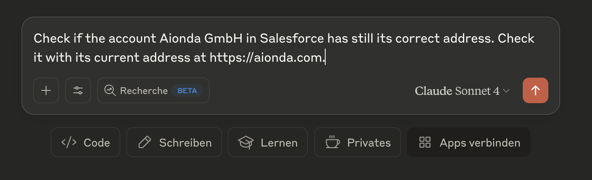
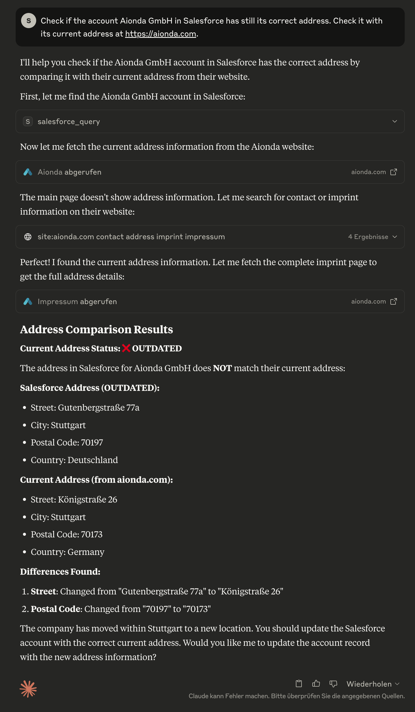
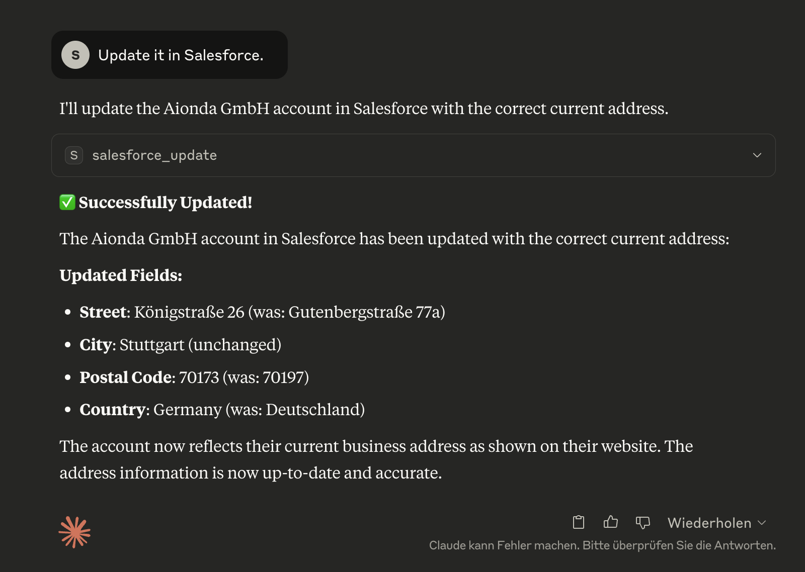
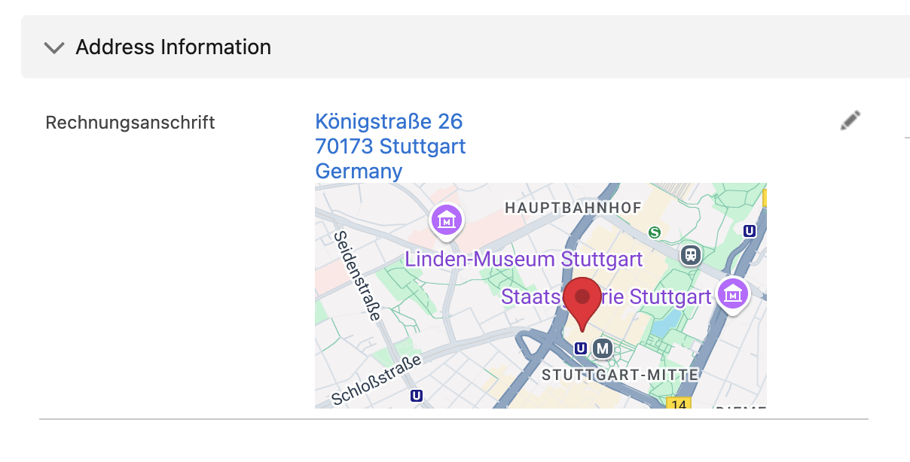

# MCP Salesforce Server

[](https://github.com/AiondaDotCom/mcp-salesforce/actions/workflows/ci.yml)

A **Model Context Protocol (MCP) server** that provides seamless integration with Salesforce using OAuth authentication. This server enables AI assistants like Claude to interact with any Salesforce organization through a secure, generic interface.

## ✨ Features

- **🎯 Seamless Authentication** - Claude automatically detects when authentication is needed and handles it transparently
- **🚀 Zero Manual Setup** - No need to run terminal commands or manual OAuth flows
- **🔐 OAuth-Only Authentication** - Secure browser-based setup with automatic token refresh
- **🌐 Universal Salesforce Integration** - Works with any Salesforce org, including custom objects and fields  
- **🧠 Smart Installation Learning** - Analyzes your complete Salesforce setup to provide intelligent assistance
- **🔍 Dynamic Schema Discovery** - Automatically adapts to your Salesforce configuration
- **🔒 Secure Token Storage** - File-based storage with strict permissions for production-grade security
- **🏠 Cross-Platform Home Directory Storage** - Credentials and cache stored in user's home directory
- **📝 Full CRUD Operations** - Query, create, update, and delete any Salesforce records
- **📊 Schema Inspection** - Get detailed information about objects and fields
- **💡 Context-Aware Suggestions** - Provides intelligent field and object name suggestions
- **💾 Comprehensive Backup System** - Complete data and file backup with support for all Salesforce file systems
- **⏰ Time Machine Feature** - Point-in-time data recovery and historical analysis
- **📁 Multi-Format File Support** - Backs up ContentVersions, Attachments, and Documents with proper metadata

## 🚀 Quick Start

### Prerequisites

- **Node.js 18+**
- **macOS** (required for secure credential storage)
- **Salesforce Connected App** with OAuth configured

### Installation Options

#### 🎯 **Recommended: NPX Usage (No Installation Required)**

Use NPX to run the MCP server without any permanent installation:

```json
{
  "mcpServers": {
    "salesforce": {
      "command": "npx",
      "args": ["@aiondadotcom/mcp-salesforce"]
    }
  }
}
```

**✅ Benefits of NPX Usage:**
- 🔄 **Always Latest**: Automatically uses the latest published version
- 💾 **No Disk Space**: No permanent installation required
- 🛡️ **No Conflicts**: No global package conflicts
- ⚡ **Easy Updates**: Just restart - gets latest version automatically
- 📋 **Simple Config**: Copy-paste ready MCP configuration

**NPX Command Line Usage:**
```bash
# Get version
npx -p @aiondadotcom/mcp-salesforce mcp-salesforce --version

# Get help
npx -p @aiondadotcom/mcp-salesforce mcp-salesforce --help

# Run OAuth setup
npx -p @aiondadotcom/mcp-salesforce mcp-salesforce setup
```

#### 🔧 **Alternative: Development Setup**

For development or customization:

1. **Clone and install dependencies**:
   ```bash
   git clone https://github.com/AiondaDotCom/mcp-salesforce.git
   cd mcp-salesforce
   npm install
   ```

2. **Configure credentials**: Use the `salesforce_setup` tool to configure your credentials when prompted

3. **Add to Claude Desktop** using local path (see [Configuration](#configuration) below)

### 🎯 **Start Using**

That's it! Claude will automatically handle setup and authentication when you first use any Salesforce tool.

**✨ Interactive Setup Process!** 
- Use the `salesforce_setup` tool to configure your credentials
- Claude will ask you for your Salesforce Connected App details
- Credentials are stored securely in your home directory
- Seamless OAuth flow directly from Claude Desktop

**🧠 Smart Learning System**
- Use `salesforce_learn` to analyze your complete Salesforce installation
- Claude learns all your custom objects, fields, and relationships
- Provides intelligent suggestions based on your specific setup
- Context-aware assistance for complex Salesforce environments

## 📦 NPM Package Status

✅ **Package Successfully Published!**

The package `@aiondadotcom/mcp-salesforce` is now **live on NPM** and ready for use.

### Using the Published Package

NPX usage is now available for all users:

```bash
# Test the published package
npx -p @aiondadotcom/mcp-salesforce mcp-salesforce --version
npx -p @aiondadotcom/mcp-salesforce mcp-salesforce --help

# Run OAuth setup
npx -p @aiondadotcom/mcp-salesforce mcp-salesforce setup
```

### Publication Details

- **Package Name**: `@aiondadotcom/mcp-salesforce`
- **Version**: `1.0.7` (latest)
- **Registry**: NPM Public Registry
- **Organization**: `@aiondadotcom`
- **Access**: Public

**Status**: 
- ✅ Package published to NPM
- ✅ NPX compatibility verified 
- ✅ Binary wrapper implemented
- ✅ Setup command functional
- ✅ MCP configuration ready
- ✅ **Available for immediate use**

🎉 All NPX functionality now works for end users worldwide!

## 🔧 Configuration

### Salesforce Connected App Setup

1. In Salesforce Setup, create a new Connected App:
   - **App Name**: MCP Salesforce Integration
   - **API Name**: mcp_salesforce_integration
   - **Contact Email**: Your email
   - **Enable OAuth Settings**: ✅ Yes
   - **Callback URL**: `http://localhost:9876/callback`
     > Port 9876 was chosen deliberately to avoid conflicts with common development servers (8080, 8000, 3000) and well-known services.
   - **Selected OAuth Scopes**:
     - Manage user data via APIs (api)
     - Perform requests at any time (refresh_token, offline_access)

2. After saving, copy the **Consumer Key** and **Consumer Secret**

### Credential Configuration

Configure your credentials using the `salesforce_setup` tool when you first use the application:

1. **Interactive Setup**: Claude will prompt you for your Salesforce credentials
2. **Client ID**: Your Salesforce Connected App Consumer Key
3. **Client Secret**: Your Salesforce Connected App Consumer Secret  
4. **Instance URL**: Your Salesforce organization URL (e.g., `https://mycompany.salesforce.com`)

The tool will validate your input and store credentials securely in `~/.mcp-salesforce.json` with restricted permissions (600).

**📁 File Locations:**
- **Credentials**: `~/.mcp-salesforce.json` (contains OAuth tokens and credentials)
- **Cache**: `~/.mcp-salesforce-cache/` (contains learned Salesforce schema and context)
- **Cross-Platform**: Works on Windows, macOS, and Linux

**Example interaction:**
```
Claude: I need to set up your Salesforce credentials first. Please use the salesforce_setup tool with your credentials.

You: Use the salesforce_setup tool with clientId: "3MVG9...", clientSecret: "1234567890...", instanceUrl: "https://mycompany.salesforce.com"

Claude: ✅ Salesforce credentials configured successfully! You can now use other Salesforce tools.
```

### Claude Desktop Integration

#### 🎯 **NPX Configuration (Recommended)**

Add this to your Claude Desktop MCP configuration (`~/Library/Application Support/Claude/claude_desktop_config.json`):

```json
{
  "mcpServers": {
    "salesforce": {
      "command": "npx",
      "args": ["@aiondadotcom/mcp-salesforce"]
    }
  }
}
```

#### 🔧 **Development/Local Configuration**

For development or customized installations:

```json
{
  "mcpServers": {
    "salesforce": {
      "command": "node",
      "args": ["/path/to/mcp-salesforce/src/index.js"]
    }
  }
}
```

#### 🌐 **VS Code MCP Configuration**

For VS Code with MCP extension:

```json
{
  "servers": {
    "salesforce": {
      "command": "npx",
      "args": ["@aiondadotcom/mcp-salesforce"]
    }
  }
}
```

## 📸 Demo Screenshots

Here's a step-by-step walkthrough of the MCP Salesforce Server in action, showing a real-world use case of verifying and updating company address information:

### Step 1: Address Verification Request

*Claude checking if the Aionda GmbH account in Salesforce has the correct address by comparing it with their current website address*

### Step 2: Address Comparison Results  

*Claude identifying that the Salesforce address is outdated, showing detailed comparison between the current Salesforce data and the actual address from the company website*

### Step 3: Automated Address Update

*Claude successfully updating the Salesforce account with the correct current address, showing exactly which fields were changed*

### Step 4: Verification in Salesforce

*The updated account record in Salesforce showing the corrected address information is now accurate and up-to-date*

## 🛠️ Available Tools

### `salesforce_learn`
**🧠 Learns your complete Salesforce installation** - Analyzes all objects, fields and customizations once and stores this information locally for intelligent assistance.

```javascript
// One-time analysis of the Salesforce installation
{}

// Force complete re-analysis
{
  "force_refresh": true,
  "detailed_relationships": true
}
```

**Why important?** 
- Claude learns your Custom Objects like "TimeTracking__c", "Project__c", etc.
- Recognizes all Custom Fields and their data types
- Provides intelligent suggestions based on your specific configuration
- Run once, then the AI benefits from it permanently

### `salesforce_installation_info`
**📊 Overview of your learned Salesforce installation** - Shows available objects, Custom Fields and customizations.

```javascript
// Complete overview of the installation
{}

// Details about a specific object
{
  "object_name": "TimeTracking__c"
}

// Search for specific fields
{
  "field_search": "email",
  "show_custom_only": true
}
```

### `salesforce_query`
Execute SOQL queries against any Salesforce object.

```javascript
// Example: Get recent contacts
{
  "query": "SELECT Id, FirstName, LastName, Email FROM Contact WHERE CreatedDate = THIS_MONTH ORDER BY CreatedDate DESC LIMIT 10"
}
```

**🧠 Smart Learning Integration:** 
- Automatically warns when installation has not been learned yet
- Suggests available objects and fields
- Helps with correct API names

### `salesforce_create`  
Create new records in any Salesforce object.

```javascript
// Example: Create a new contact
{
  "sobject": "Contact",
  "data": {
    "FirstName": "John",
    "LastName": "Doe", 
    "Email": "john.doe@example.com",
    "Phone": "555-1234"
  }
}
```

**🧠 Smart Context:** Automatically shows required fields for the selected object when the installation has been learned.

### `salesforce_update`
Update existing records.

```javascript
// Example: Update a contact's email
{
  "sobject": "Contact",
  "id": "003XX000008b6cYAQ",
  "data": {
    "Email": "new.email@example.com",
    "Phone": "555-5678"
  }
}
```

**🧠 Smart Context:** Considers field permissions and data types from the learned installation.

### `salesforce_delete`
Delete records (⚠️ permanent action).

```javascript
// Example: Delete a record
{
  "sobject": "Contact", 
  "id": "003XX000008b6cYAQ"
}
```

### `salesforce_describe`
Get schema information for objects and fields.

```javascript
// Example: Get Contact object schema
{
  "sobject": "Contact"
}

// Or get list of all available objects
{} // Empty parameters
```

### `salesforce_backup`
**💾 Comprehensive Backup System for Salesforce** - Creates complete backups of all data and files with detailed recovery information.

```javascript
// Create complete backup
{}

// Incremental backup since specific date
{
  "backup_type": "incremental",
  "since_date": "2025-01-01T00:00:00Z"
}

// Backup with specific options
{
  "options": {
    "include_files": true,
    "include_attachments": true,
    "include_documents": true,
    "parallel_downloads": 10
  }
}
```

**What is backed up:**
- **📊 All Object Data** - All queryable objects with up to 20 fields per object
- **📁 Modern Files** - ContentVersions with complete metadata
- **📎 Legacy Attachments** - Classic attachments with correct file extensions
- **📄 Documents** - Folder-based documents from the legacy system
- **🏗️ Schema Information** - Complete object structures and relationships
- **📋 Backup Manifest** - Detailed statistics and recovery information

**Backup Structure:**
```
salesforce-backup-2025-06-04T16-16-35-660Z/
├── metadata/           # Schema and object definitions
├── data/              # JSON data of all objects
├── files/
│   ├── content-versions/  # Modern files
│   ├── attachments/       # Legacy attachments
│   └── documents/         # Legacy documents
└── backup-manifest.json   # Backup overview
```

### `salesforce_backup_list`
**📋 Show Available Backups** - Overview of all local backups with statistics and metadata.

```javascript
// List all available backups
{}

// Details about a specific backup
{
  "backup_name": "salesforce-backup-2025-06-04T16-16-35-660Z"
}
```

### `salesforce_time_machine`
**⏰ Time Travel Through Salesforce Data** - Analyzes data changes between different backup time points and enables targeted recovery.

```javascript
// Compare current state with a backup
{
  "backup_timestamp": "2025-06-04T16:16:35.660Z",
  "object_name": "Account"
}

// Show all changes since a specific backup
{
  "backup_timestamp": "2025-06-04T16:16:35.660Z",
  "show_all_changes": true
}

// Detailed analysis for specific records
{
  "backup_timestamp": "2025-06-04T16:16:35.660Z",
  "object_name": "Contact", 
  "record_id": "003XX000008b6cYAQ"
}
```

**Time Machine Features:**
- **📊 Data Comparison** - Shows differences between backup and current state
- **🔍 Change History** - Which fields were changed when
- **🗑️ Deleted Records** - Finds records that were deleted since the backup
- **📈 Growth Analysis** - Statistical evaluation of data development
- **🎯 Targeted Recovery** - Precise identification of changes

### `salesforce_auth`
Authenticate with Salesforce. Automatically detects if authentication is needed and handles OAuth flow.

```javascript
// Example: Standard authentication (detects if needed)
{}

// Example: Force re-authentication even if tokens appear valid
{
  "force": true
}
```

**✨ Key Features:**
- **Automatic Detection**: Claude automatically suggests this tool when authentication is needed
- **No Manual Setup**: Eliminates the need to run `npm run setup` manually  
- **Smart Authentication**: Only authenticates when necessary, checks existing tokens first
- **Seamless Integration**: Works transparently in the background

This tool is **automatically suggested** when:
- You try to use Salesforce tools without authentication
- Your tokens have expired
- Authentication errors occur
- First-time setup is needed

## 🧠 Smart Learning System

### Why is Learning Important?

Every Salesforce installation is unique with:
- **Custom Objects** like "TimeTracking__c", "Project__c", "CustomerCare__c"
- **Custom Fields** on standard objects
- **Specific Workflows** and validation rules
- **Individual Data Structures**

The AI's normal training model only knows standard Salesforce objects. Without knowledge of your specific installation, the AI cannot provide intelligent assistance.

### How Does Learning Work?

1. **One-time Analysis**: `salesforce_learn` analyzes your complete installation
2. **Local Documentation**: All objects, fields and relationships are stored locally
3. **Intelligent Support**: Claude can then make precise suggestions and answer complex questions

### Example Workflow:

```
You: "Are there any time tracking entries for July 2025?"

Without Learning:
❌ Claude: "I don't know any object called 'TimeTracking'"

With Learning:
✅ Claude: "I'm checking the 'TimeTracking__c' object for entries from July 2025..."
   Automatically executes the correct SOQL query
```

### When Should You Use Learning?

- **During initial setup** - Once after installation
- **After major changes** - When new Custom Objects are added
- **When having problems** - When Claude doesn't find objects or fields

### What is Learned?

- **All SObjects** (Standard and Custom)
- **All Fields** with data types and permissions
- **Relationships** between objects
- **Picklist Values** and validation rules
- **Required Fields** for better validation

**💡 Learning runs only once and then makes all further interactions much more intelligent!**

## 💡 Usage Examples

### 🚀 First Steps After Installation

1. **Authentication**: Claude automatically detects when authentication is needed
2. **Start Learning**: 
   ```
   You: "Learn my Salesforce installation"
   Claude: Automatically uses the salesforce_learn tool
   ```
3. **Explore Installation**:
   ```
   You: "Show me an overview of my Salesforce installation"
   Claude: Uses salesforce_installation_info for a summary
   ```

### 🔍 Intelligent Queries with Learned Installation

```
You: "Show me all projects from this year"
Claude: Automatically recognizes your "Project__c" Custom Object and creates:
SELECT Id, Name, StartDate__c, Status__c FROM Project__c WHERE CALENDAR_YEAR(CreatedDate) = 2025
```

```
You: "Are there any time tracking entries for July 2025?"
Claude: Finds your "TimeTracking__c" object and queries:
SELECT Id, Name, Month__c, Hours__c FROM TimeTracking__c WHERE Month__c = 'July 2025'
```

### Query Examples

```soql
-- Get all accounts in the technology industry
SELECT Id, Name, Industry, Website FROM Account WHERE Industry = 'Technology'

-- Find contacts created this week
SELECT Id, Name, Email, CreatedDate FROM Contact WHERE CreatedDate = THIS_WEEK

-- Get opportunities closing this quarter
SELECT Id, Name, Amount, CloseDate FROM Opportunity WHERE CloseDate = THIS_QUARTER
```

### Working with Custom Objects

The server automatically discovers custom objects:

```javascript
// Describe a custom object
{
  "sobject": "CustomProject__c"
}

// Query custom object
{
  "query": "SELECT Id, Name, CustomField__c FROM CustomProject__c LIMIT 10"
}

// Create custom object record
{
  "sobject": "CustomProject__c",
  "data": {
    "Name": "New Project",
    "CustomField__c": "Custom Value"
  }
}
```

## 💾 Backup & Time Machine Features

### 🚀 Salesforce Backup System

The MCP Salesforce Server offers a **professional backup system** that can secure your complete Salesforce installation:

#### What Makes the Backup System Special?

- **🎯 Complete Coverage**: Backs up all three Salesforce file systems
  - **Modern Files** (ContentDocument/ContentVersion) 
  - **Legacy Attachments** (classic attachments)
  - **Documents** (folder-based legacy documents)

- **📊 Intelligent Data Collection**: 
  - All queryable objects (Standard + Custom)
  - Up to 20 fields per object for comprehensive data backup
  - Automatic filtering of binary fields

- **⚡ High Performance**:
  - Parallel downloads with configurable concurrency
  - Retry logic with exponential backoff
  - Batch processing for large data volumes

#### Creating a Backup

```
You: "Create a backup of my Salesforce data"
Claude: Automatically starts the salesforce_backup tool
```

**Backup Result:**
```
✅ Backup successfully created!
📊 Statistics:
- 7 objects backed up
- 1,247 records exported  
- 6 files downloaded
- 4.07 MB total size
- Duration: 23 seconds

📁 Location: /backups/salesforce-backup-2025-06-04T16-16-35-660Z/
```

#### Backup Structure

```
salesforce-backup-2025-06-04T16-16-35-660Z/
├── backup-manifest.json     # Backup overview with statistics
├── metadata/
│   ├── objects-schema.json  # All object definitions
│   └── file-manifest.json   # File download protocol
├── data/                    # JSON data of all objects
│   ├── Account.json         # Account records
│   ├── Contact.json         # Contact records
│   ├── Opportunity.json     # Opportunity records
│   └── CustomObject__c.json # Custom Object data
└── files/                   # All Salesforce files
    ├── content-versions/    # Modern files (.pdf, .docx, etc.)
    ├── attachments/         # Legacy attachments
    └── documents/           # Legacy documents
```

### ⏰ Time Machine Feature

The **Time Machine** enables you to travel through time and analyze data changes:

#### Main Features

- **🔍 Data Comparison**: Compares current state with historical backups
- **📊 Change Analysis**: Shows exactly which fields have changed
- **🗑️ Deleted Records**: Finds records that were deleted since the backup
- **📈 Trend Analysis**: Statistical evaluation of data development

#### Using Time Machine

```
You: "Compare the current Account data with the backup from June 4th"
Claude: Uses salesforce_time_machine for detailed analysis
```

**Example Result:**
```
⏰ Time Machine Analysis - Account Object
📅 Backup: 2025-06-04T16:16:35.660Z vs. Current

📊 Changes found:
• Modified records: 3
• New records: 2  
• Deleted records: 1

🔍 Details:
Account "Aionda GmbH" (001XX000003DHPF):
- BillingStreet: "Alte Straße 1" → "Königstraße 10a"
- BillingCity: "München" → "Stuttgart"
- LastModifiedDate: 2025-06-04 → 2025-06-04

Account "TechCorp Ltd" (001XX000003DHPG):
- Status: Active → Inactive
- LastModifiedDate: 2025-06-03 → 2025-06-04
```

#### Practical Use Cases

1. **📋 Compliance & Audit**: Evidence of data changes
2. **🔧 Error Analysis**: "What was different before the problem?"
3. **📊 Data Quality**: Monitoring data integrity
4. **🚨 Change Management**: Control over critical changes
5. **💡 Business Intelligence**: Trend analysis over time

### 🎯 Recommended Backup Workflow

```
1. Initial Setup:
   You: "Learn my Salesforce installation"
   → Claude analyzes your complete org
   
2. Regular Backups:
   You: "Create a backup"
   → Claude backs up all data and files
   
3. Monitoring:
   You: "Show me all available backups"
   → Claude lists backup history
   
4. Analysis:
   You: "What has changed since the last backup?"
   → Claude uses Time Machine for comparison
```

**💡 Pro Tip**: Combine Learning + Backup + Time Machine for maximum Salesforce control!

## 🔒 Security

- **Token Storage**: Refresh tokens stored securely in `cache/salesforce-tokens.json` with restricted file permissions (600)
- **No Plaintext Secrets**: Access tokens kept in memory only
- **Automatic Refresh**: Tokens refreshed automatically before expiration
- **Secure Cleanup**: Tokens removed from memory after use
- **Input Validation**: All inputs validated and sanitized
- **Migration**: File-based token storage with 600 permissions for secure credential management

## 🧪 Testing

```bash
# Run tests
npm test

# Test authentication
npm run setup -- --test

# Validate configuration
npm run setup -- --validate
```

## 🐛 Troubleshooting

### Authentication Issues

**🎯 Automatic Authentication**: Claude automatically detects authentication issues and suggests the `salesforce_auth` tool. No manual troubleshooting needed!

**Common Scenarios:**
1. **First-time use**: Claude will automatically suggest authentication when you first try to use Salesforce tools
2. **Token expiration**: When tokens expire, Claude detects this and prompts for re-authentication  
3. **Invalid credentials**: Clear error messages guide you to fix configuration issues
4. **Session expired**: Automatic detection with friendly prompts to re-authenticate

### Token Security

**🔒 Secure Token Storage**: Authentication tokens are stored securely in the local file system with strict permissions.

**Security Features:**
- **File Permissions**: Token files are created with `0600` permissions (readable/writable only by owner)
- **Location**: Tokens stored in `cache/salesforce-tokens.json` (excluded from git)
- **Automatic Security**: Permission verification and automatic fixing if needed
- **No Network Exposure**: Tokens never leave your local machine
- **File-based Security**: Secure token storage with strict file permissions for credential protection

**Security Verification:**
```bash
# Check token file security
ls -la cache/salesforce-tokens.json
# Should show: -rw------- (600 permissions)

# Run security test
node test-token-security.js
```

**What this means:**
- Other users on your system **cannot** read your Salesforce tokens
- Only your user account has access to the authentication data
- Prevents unauthorized access to your Salesforce organization
- Complies with security best practices for credential storage

### Quick Fix in Claude Desktop
If you get authentication errors, simply tell Claude:
```
Authenticate with Salesforce
```
Or Claude will automatically suggest: `Use the salesforce_auth tool to authenticate with Salesforce`

**✨ No more manual terminal setup!** Everything happens seamlessly through Claude Desktop.

### Connection Issues

1. **"Cannot connect to Salesforce"**: Verify your Instance URL
2. **"Insufficient permissions"**: Check user permissions in Salesforce
3. **"CORS errors"**: Ensure Connected App callback URL is correct

### Common SOQL Errors

1. **Field not found**: Use API names, not field labels
2. **Object not found**: Check spelling and API name of objects
3. **Syntax errors**: Ensure proper SOQL syntax with single quotes

## 📚 Documentation

- [OAuth Setup Guide](docs/oauth-guide.md) - Detailed Connected App configuration
- [Setup Instructions](docs/setup.md) - Step-by-step setup process  
- [Usage Examples](docs/examples.md) - Comprehensive usage examples
- [Architecture Plan](mcp-salesforce-architecture.md) - Technical architecture details

## 🤝 Contributing

1. Fork the repository
2. Create a feature branch: `git checkout -b feature-name`
3. Make your changes and test thoroughly
4. Submit a pull request with detailed description

## 📄 License

MIT License - see [LICENSE](LICENSE) file for details.

## 🆘 Support

- **Issues**: Report bugs and feature requests via GitHub Issues
- **Documentation**: Check the `docs/` folder for detailed guides
- **Community**: Join discussions in GitHub Discussions

---

**Made with ❤️ for the MCP ecosystem**
